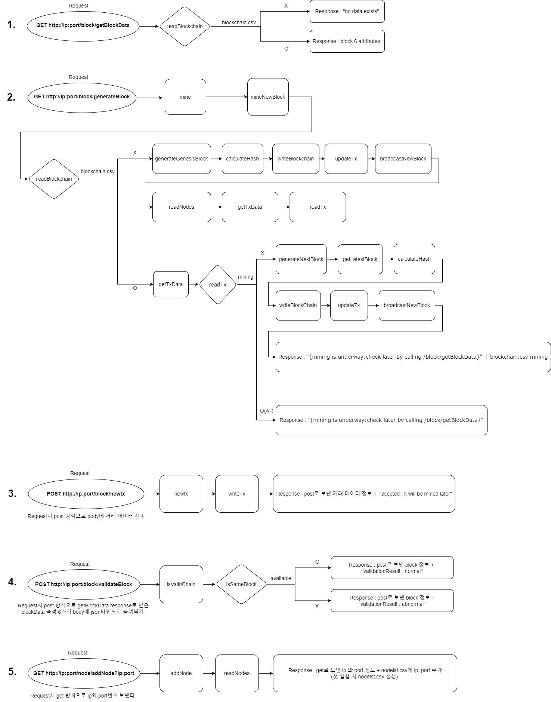

# KopoBlockChain
___
## :books: Index
##### 1. [Project Introduction](#mag_right-project-introduction)
##### 2. [Execution method](#book-execution-method)
##### 3. [Function](#pushpin-function)
##### 4. [Diagram](#memo-diagram)
___
## :mag_right: Project Introduction
- Block and transaction data generation
- Learning Blockchain Principles through Block Mining
___
## :book: Execution method
1. Server running(ip, port)
2. After changing the bottom url ip and port,
   make a request to the server
3. Response from server
___
### :pushpin: Function
#### - getBlockData
Get block data (blockchain.csv) information

```
GET 'http://ip:port/block/getBlockData'
```


#### - generateBlock
Create block and add blockchain.csv (create blockchain.csv on first run)

```
GET 'http://ip:port/block/generateBlock'
```


#### - newtx
Create new transaction data (create txData.csv on first run)

```
POST 'http://ip:port/block/newtx'
```


#### - validateBlock
Comparison of my socket server block and the requested counterpart server block (validation check)

```
POST 'http://ip:port/block/validateBlock'
```


#### - addNode
Add server ip, port to be linked during broadcasting (create nodelst.csv on first run)

```
GET 'http://ip:port/node/addNode?ip:port'
```

___
### :memo: Diagram

